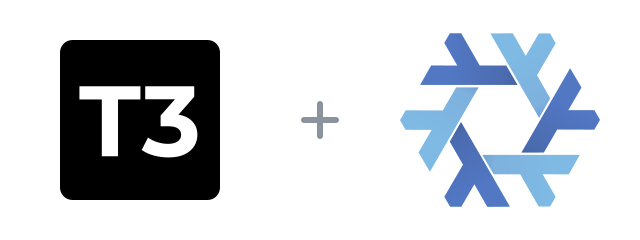

<p align="center">
  
</p>

<h1 align="center">t3code-flake</h1>

<p align="center">
  <a href="flake.nix"></a>
  <a href="LICENSE"></a>
  <a href="https://github.com/pingdotgg/t3code/releases/tag/v0.0.42"></a>
</p>

[T3 Code](https://t3.codes) is a desktop interface for running coding agents on your own machine.

This flake packages the official Linux AppImage as a reproducible Nix package, including its desktop entry and icons. It supports x86_64 and ARM64 Linux.

```sh
nix run github:Fractal-Tess/t3code-flake
```

## Install in a Nix configuration

Add the flake input:

```nix
inputs.t3code-flake.url = "github:Fractal-Tess/t3code-flake";
```

Use the NixOS or Home Manager module:

```nix
# NixOS
{
  imports = [ inputs.t3code-flake.nixosModules.default ];
  programs.t3code.enable = true;
}

# Home Manager
{
  imports = [ inputs.t3code-flake.homeManagerModules.default ];
  programs.t3code.enable = true;
}
```

The module defaults to the flake's `t3code` package. You can override it with `programs.t3code.package`, or use `overlays.default` to expose `pkgs.t3code`.

T3 Code needs at least one authenticated provider CLI, such as Codex, Claude Code, Cursor, Grok Build, or OpenCode. See the [upstream installation guide](https://github.com/pingdotgg/t3code/blob/main/docs/user/install.md) for provider setup.

## Update

Update `version`, release URLs, and hashes in [`packages/t3code.nix`](packages/t3code.nix), then run:

```sh
nix flake check
```

## Credits

[GitHub](https://github.com/Fractal-Tess/t3code-flake)

The flake packaging is [MIT](LICENSE). T3 Code is [MIT licensed](https://github.com/pingdotgg/t3code/blob/main/LICENSE), © 2026 T3 Tools Inc.

The logo combines the [T3 Code mark](https://github.com/pingdotgg/t3code/blob/main/assets/prod/logo.svg) with the [Nix snowflake](https://github.com/NixOS/nixos-artwork/tree/master/logo) by Simon Frankau and Tim Cuthbertson ([CC BY 4.0](https://creativecommons.org/licenses/by/4.0/)), resized and arranged here.
