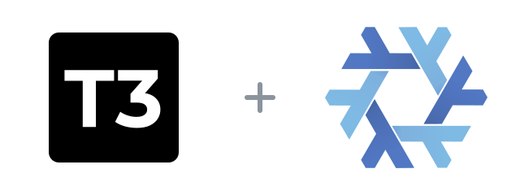

<p align="center">
  
</p>

<h1 align="center">t3code-flake</h1>

<p align="center">
  <a href="flake.nix"></a>
  <a href="LICENSE"></a>
  <a href="https://github.com/pingdotgg/t3code/releases/tag/v0.0.44"></a>
</p>

[T3 Code](https://t3.codes) is a desktop interface for running coding agents on your own machine.

This flake packages the official Linux AppImage as a reproducible Nix package, including its desktop entry and icons. It supports x86_64 and ARM64 Linux.

```sh
nix run github:Fractal-Tess/t3code-flake
```

## Install in a Nix configuration

Add the flake input:

```nix
inputs.t3code-flake.url = "github:Fractal-Tess/t3code-flake";
```

Use the NixOS or Home Manager module:

```nix
# NixOS
{
  imports = [ inputs.t3code-flake.nixosModules.default ];
  programs.t3code.enable = true;
}

# Home Manager
{
  imports = [ inputs.t3code-flake.homeManagerModules.default ];
  programs.t3code.enable = true;
}
```

The module defaults to the flake's `t3code` package. You can override it with `programs.t3code.package`, or use `overlays.default` to expose `pkgs.t3code`.

### Pair other devices with the desktop app

The desktop app runs its own server. These options configure it declaratively:

```nix
programs.t3code = {
  enable = true;
  serverExposureMode = "network-accessible"; # or "local-only"; null keeps the in-app setting
  port = 3773;                               # T3CODE_PORT; null scans from 3773
  firewallInterfaces = [ "wt0" ];            # NixOS only; needs port
};
```

`serverExposureMode` is merged into `~/.t3/userdata/desktop-settings.json` each time the app starts, so it wins over the in-app toggle. `cli.enable` (default `true`) also installs the `t3` command, so `t3 pair` works without the headless service.

Don't enable `services.t3code-server` on a machine that runs the desktop app: both use port 3773 and the same `~/.t3` data by default.

## Headless server

`t3code-server` runs the server bundled in the AppImage (`t3 serve`) with Node, so you can open T3 Code in a browser or pair other devices with it.

```sh
nix run github:Fractal-Tess/t3code-flake#server -- serve --host 0.0.0.0
```

Both modules provide `services.t3code-server`, a systemd user service:

```nix
services.t3code-server = {
  enable = true;
  host = "0.0.0.0"; # default 127.0.0.1
  port = 3773;
  # NixOS only: user = "alice"; openFirewall = true; firewallInterfaces = [ "wt0" ];
};
```

The service uses T3 Code's default data directory (`~/.t3`) unless `baseDir` is set. Pair a device with `t3 pair`, or read the pairing URL from `journalctl --user -u t3code-server`. On NixOS, set `users.users.<name>.linger = true` to keep it running while you are logged out.

T3 Code needs at least one authenticated provider CLI, such as Codex, Claude Code, Cursor, Grok Build, or OpenCode. See the [upstream installation guide](https://github.com/pingdotgg/t3code/blob/main/docs/user/install.md) for provider setup.

## Update

The daily [update workflow](.github/workflows/update.yml) checks the latest stable upstream release, refreshes both Linux hashes, builds the package, and commits a validated update. Run the same process locally with:

```sh
./scripts/update.sh
```

Pass a stable version such as `./scripts/update.sh 0.0.44` to update to a specific release. The workflow can also be started manually from GitHub Actions.

## Credits

[GitHub](https://github.com/Fractal-Tess/t3code-flake)

The flake packaging is [MIT](LICENSE). T3 Code is [MIT licensed](https://github.com/pingdotgg/t3code/blob/main/LICENSE), © 2026 T3 Tools Inc.

The logo combines the [T3 Code mark](https://github.com/pingdotgg/t3code/blob/main/assets/prod/logo.svg) with the [Nix snowflake](https://github.com/NixOS/nixos-artwork/tree/master/logo) by Simon Frankau and Tim Cuthbertson ([CC BY 4.0](https://creativecommons.org/licenses/by/4.0/)), resized and arranged here.
